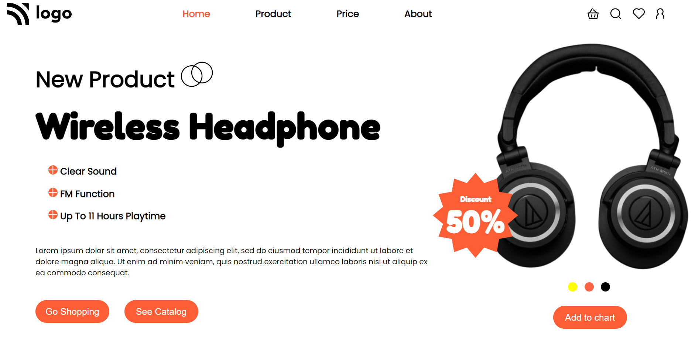

# Product 

## About Project

It's a home page of some shopping website which is featuring a headphone and it's huge discount on it. As you can see, it also conveying the features of the featured product (i.e. Headphone) for attracting the customers. 

## Concepts Used

 - Flex display property for mostly aligning divs.
 - positioning used for aligning that price sticker
 - media queires for making it responsive.

## Time Taken

It took me around 5 hours and an additional hour to make it responsive.

## Find me on
 
 - [LinkedIn](https://www.linkedin.com/in/varun-g-65282489)
 - [GitHub](https://github.com/varung735)

> This webpage is responsive. You can access it from your mobile phones, tablets etc.

## Thank you.